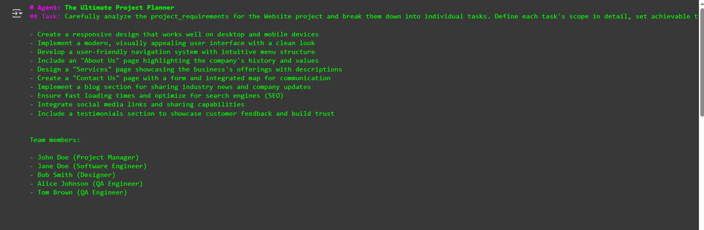

# Automated Project: Planning, Estimation, and Allocation

This project demonstrates an automated system for planning, estimation, and resource allocation using the [CrewAI](https://github.com/joaomdmoura/crewAI) framework. The solution orchestrates agents to collaboratively perform planning and workload distribution tasks based on inputs and predefined logic.
## 📊 Project Planning Output



## Features

- 🧠 Agent-based decision making using CrewAI
- 🔄 Automatic workload planning and task distribution
- 🗂️ Role-based task delegation
- 📈 Project planning using human-like agents

## Installation

To run this notebook locally, first install the required libraries:

```bash
pip install crewai

Usage
Run the notebook step-by-step to:

Initialize the CrewAI environment

Define agents and tasks

Allocate tasks based on roles and logic

Review the generated project plan

Technologies Used
Python

CrewAI

YAML for configuration

Jupyter Notebook

Getting Started
Clone this repository or download the notebook.

Install dependencies using pip install crewai.

Open the notebook and run each cell in order.

Customize agent roles and tasks for your specific use case.


